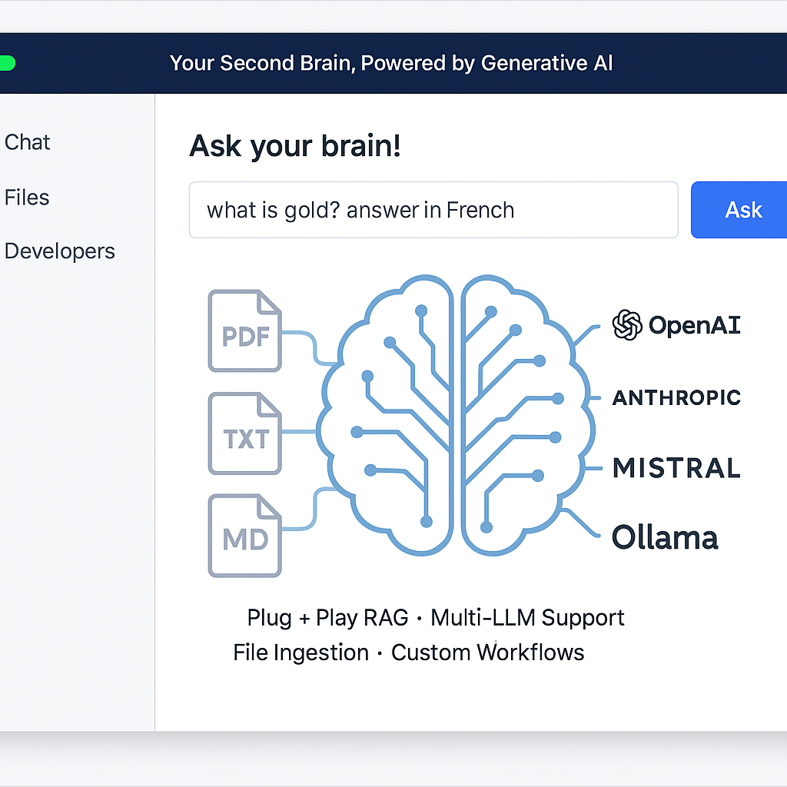
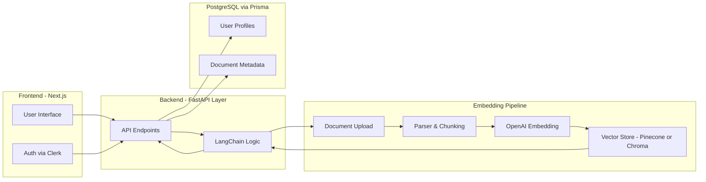

# SkillSync – AI-Powered Full Stack Knowledge Assistant

**SkillSync** is a production-grade, AI-enhanced knowledge management system built using modern web technologies. It enables users to ingest, organize, and retrieve information using natural language queries, embedding-based vector search, and an intuitive interface.

This project integrates a semantic search pipeline powered by OpenAI embeddings and provides a highly scalable architecture leveraging Next.js, PostgreSQL, Prisma ORM, and Tailwind CSS.



## Key Features

- Natural Language Search leveraging OpenAI embeddings
- Vector database integration for semantic information retrieval
- File ingestion and text parsing with flexible tagging and labeling
- AI Assistant to answer user queries based on indexed content
- PostgreSQL + Prisma ORM for efficient and relational data modeling
- Built using React (Next.js) and styled with Tailwind CSS
- Dockerized setup for simplified development and deployment
- Secure authentication with Clerk (optional integration)

## Technology Stack

| Category        | Technologies                         |
|----------------|--------------------------------------|
| Frontend        | Next.js, React, Tailwind CSS         |
| Backend         | Node.js, TypeScript                  |
| AI & NLP        | OpenAI Embeddings, LangChain         |
| Database        | PostgreSQL, Prisma ORM               |
| Deployment      | Docker, Vercel                       |
| Authentication  | Clerk (optional, replaceable)        |

## Folder Structure

```
SkillSync/
├── app/              # Frontend and API routes
├── lib/              # Embedding and helper functions
├── prisma/           # DB schema and seed files
├── public/           # Static assets
├── styles/           # Tailwind CSS config
├── assets/           # Visuals and diagrams
└── README.md
```

## Setup Instructions

### 1. Clone & Install

```bash
git clone https://github.com/yourusername/SkillSync.git
cd SkillSync
npm install
```

### 2. Configure `.env.local`

```env
DATABASE_URL=postgresql://<user>:<password>@localhost:5432/skillsync
OPENAI_API_KEY=your_openai_key
```

### 3. Run Locally

```bash
npx prisma migrate dev --name init
npm run dev
```

- App: http://localhost:3000
- API Docs (if added): http://localhost:3000/api

## Use Cases

- Internal knowledge bases for dev teams
- AI-enhanced documentation portals
- LLM-powered personal assistants with embedded memory

## License

Distributed under MIT License.

## Acknowledgements

- Based on [Quivr](https://github.com/StanGirard/quivr)
- Powered by OpenAI + LangChain + Next.js + Prisma

## Architecture


## Architecture


